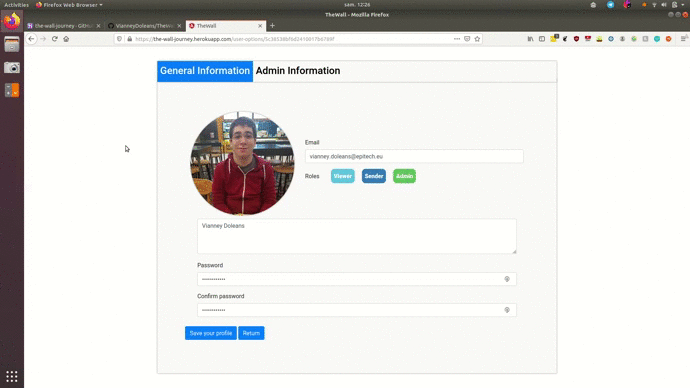

<h1 align="center">
   
  
   
  TheWall
   
</h1>

<h4 align="center">Gallery wall for your travel photos</h4>

  <a href="#presentation">Presentation</a> •
  <a href="#technologies">Technologies</a> •
    <a href="#features">Features</a> •
  <a href="#how-to-use">How To Use</a> •
  <a href="#download">Download</a> •
  <a href="#contributors">Contributors</a> •
  <a href="#visuals">Visuals</a>

  <a href="api/README.md">API</a> •
  <a href="front/README.md">Front</a>

## Presentation

[TheWall](https://the-wall-journey.herokuapp.com) project is a picture gallery.  
You can publish pictures (tags, description, etc), add comments, search pictures by filters, do moderation stuffs etc.  

We've created this platform to publish our travel photos from South Korea (2018-2019, Chung-Ang University, Seoul, 10 months).  
This project can be reused for another purpose.

## Technologies

This project is using fullstack JS technologies :
- [TypeScript](https://www.typescriptlang.org/)
- [Angular](https://angular.io/)
- [FeathersJS](https://feathersjs.com/)
- [MongoDB](https://mongoosejs.com/)

## Features

Main features :

- Publish pictures
- Comments
- Download
- Search by filters
- consult news feed
- Modify your profile, password etc.
- Moderation
  - Delete pictures
  - Delete comments
  - Delete accounts
  - Assign or remove role(s)

Available actions depend of your role(s)

## How to Use

You can go to our website [here](https://the-wall-journey.herokuapp.com).  

In case you want to deploy the platform, you can put everything on [Heroku](https://www.heroku.com/home), on 2 different instances (one for front and one for api), create a MongoDB on [mLab](https://mlab.com/), then configure api and front (see [API](api/README.md) and [Front](front/README.md)).  
Heroku and mLab are free, you will also need a [Google Drive](https://www.google.com/drive/) account for picture storage.

## Download

You can [download](https://github.com/VianneyDoleans/TheWall/releases/tag/v1.0.0) the latest version here.

## Contributors

- [Valentin Montage](https://github.com/ValMont13)
- [Vianney Doleans](https://github.com/VianneyDoleans)
- [Clément Nancelle](https://github.com/Hardkaise)
- [Philippe Antunes](https://github.com/Deartchix)

## Visuals

Overall :

  

Admin panel :

  

picture panel :

  

Scroll (pagination) :

  

